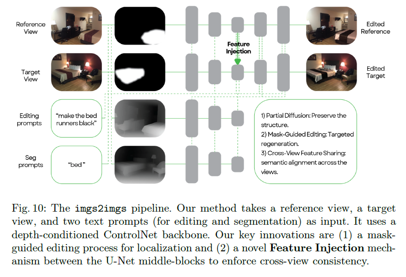
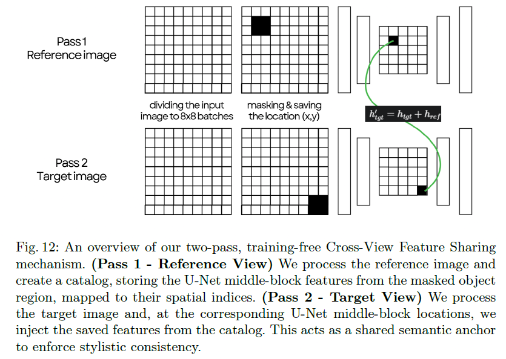
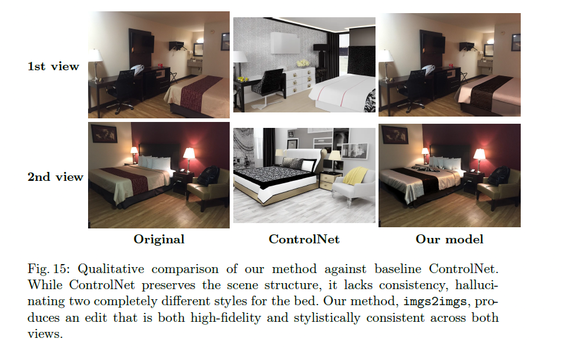
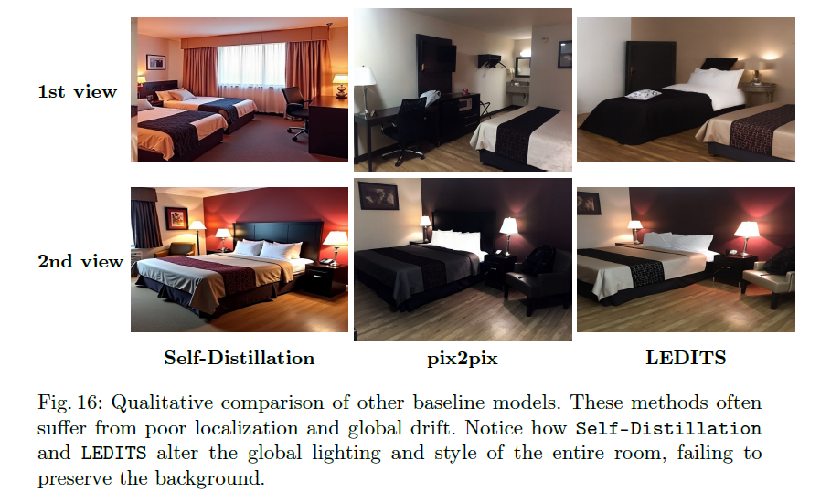
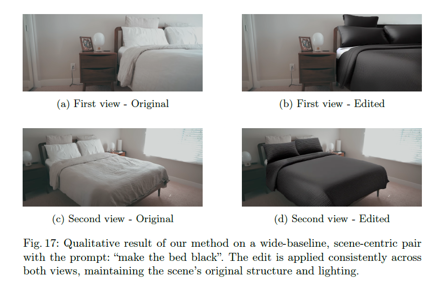
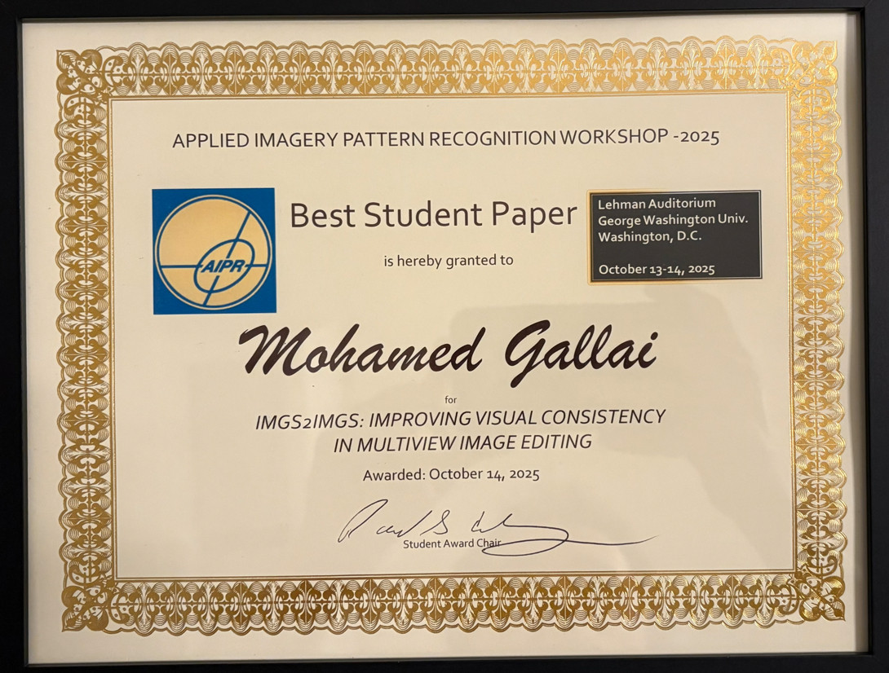

# imgs2imgs: Improving Visual Consistency in Multiview Image Editing

Training-free multiview editing with localized control + cross-view consistency.

**Authors:** Mohamed Gallai, Abby Stylianou  
**Venue:** Applied Imagery Pattern Recognition Workshop (AIPR 2025) — *to appear in Springer proceedings*  
🏆 **Best Student Paper — AIPR 2025 (Oral)**  
📄 **Preprint (author-created):** [paper/preprint.pdf](paper/preprint.pdf)

---

## What this work solves
Multiview image editing (wide-baseline pairs) often fails due to **cross-view inconsistency** and poor **localized control**.  
This work introduces a lightweight, training-free pipeline that improves consistency while keeping edits localized.

---

## Key contributions
- **Mask-guided partial diffusion** to localize edits  
- **Training-free cross-view feature sharing** to improve consistency across viewpoints  

---

## Method Overview
High-level pipeline of the proposed imgs2imgs framework.

---

## Cross-view Feature Sharing
Two-pass inference strategy used to transfer structural features between views.

---

## Qualitative Comparisons
Comparison against baseline methods showing improved consistency.

  

---

## Result
Example of localized, consistent multiview editing result.

---

🏆 **Best Student Paper — AIPR 2025 (Oral)**  

---

## Citation

imgs2imgs: Improving Visual Consistency in Multiview Image Editing  
Mohamed Gallai, Abby Stylianou  
Applied Imagery Pattern Recognition Workshop (AIPR), 2025  
To appear in Springer proceedings
